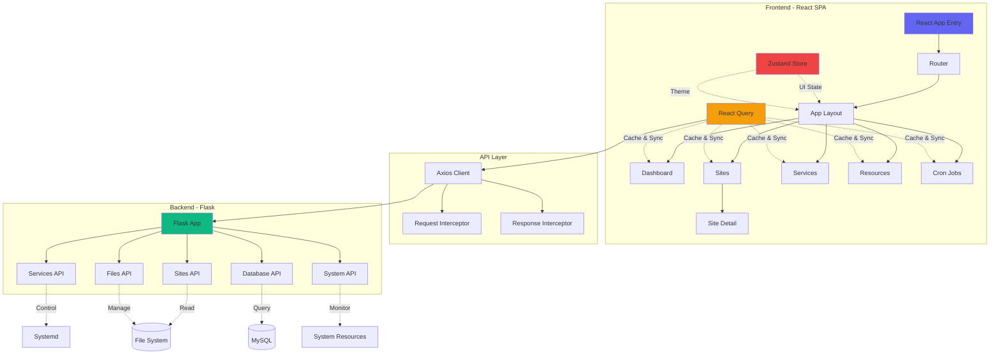
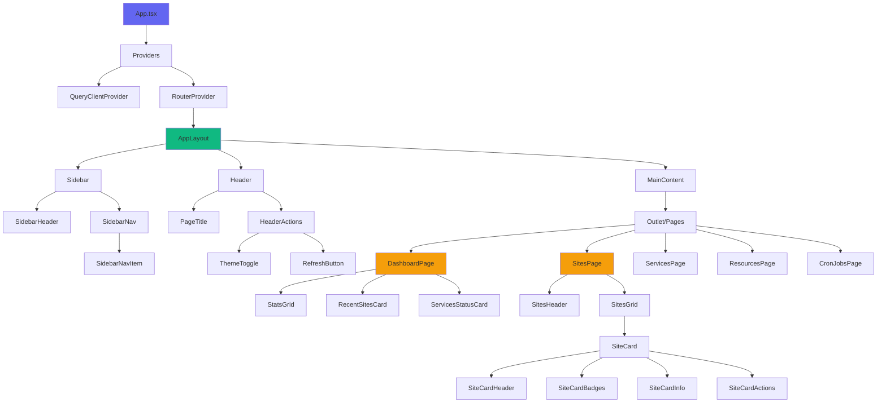
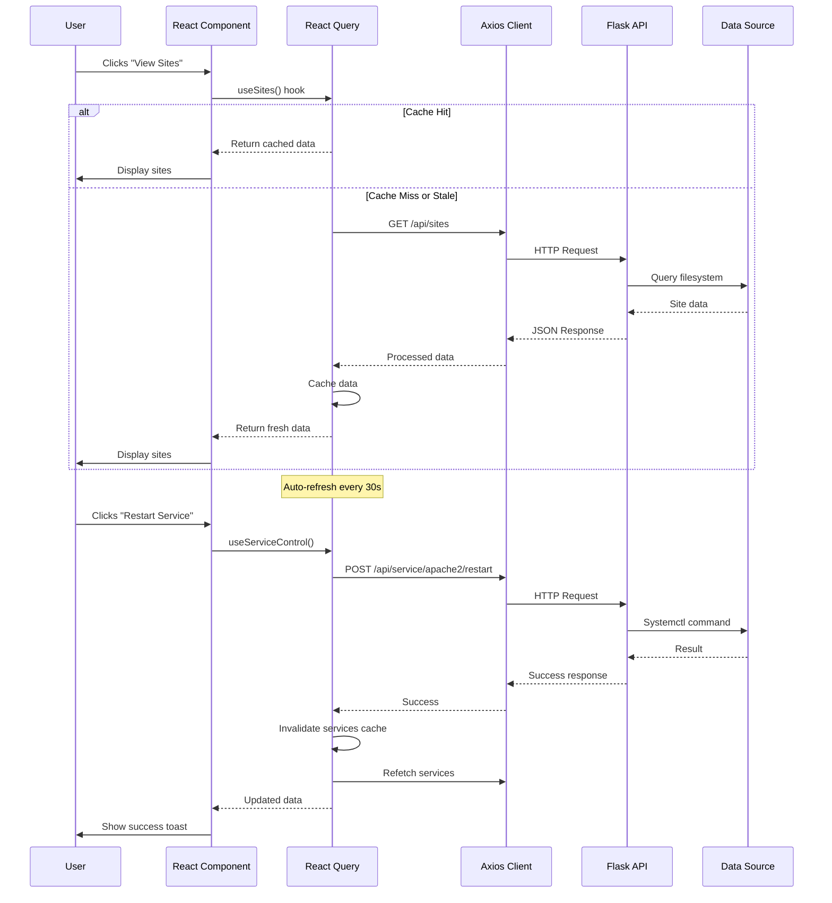
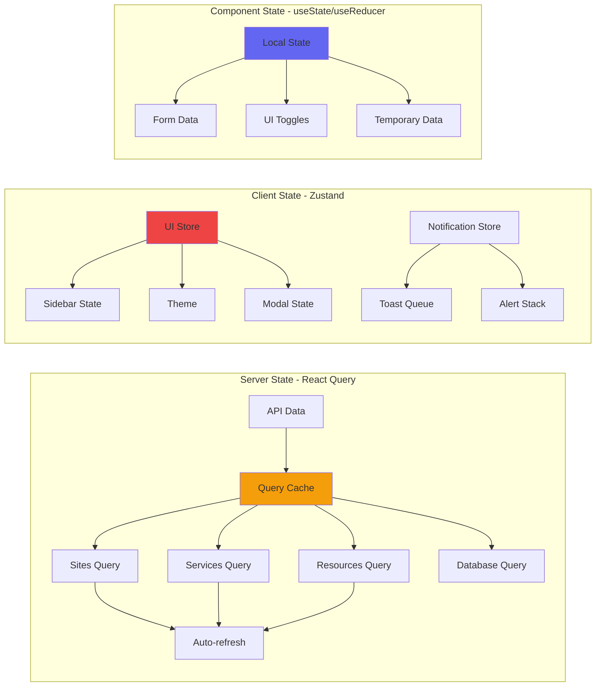
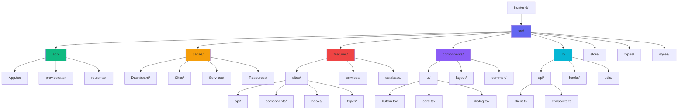
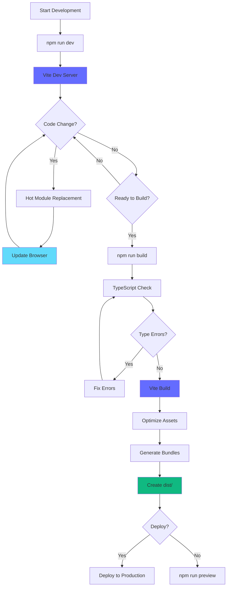

# Website Manager - Architecture Diagrams

## System Architecture Overview



## Component Hierarchy



## Data Flow Architecture



## State Management Flow



## File Structure Visualization



## Technology Stack Dependencies

```mermaid
graph TB
    subgraph "Build Tools"
        A[Vite]
        A --> B[TypeScript Compiler]
        A --> C[PostCSS]
        C --> D[Tailwind CSS]
    end
    
    subgraph "Core Framework"
        E[React 18]
        E --> F[React Router v6]
        E --> G[React Query v5]
    end
    
    subgraph "UI Layer"
        H[Shadcn/ui]
        H --> I[Radix UI]
        H --> D
        I --> J[React ARIA]
    end
    
    subgraph "State Management"
        K[Zustand]
        G --> L[Query Cache]
    end
    
    subgraph "HTTP Client"
        M[Axios]
        M --> N[Interceptors]
    end
    
    subgraph "Utilities"
        O[Lucide React Icons]
        P[clsx/tailwind-merge]
        Q[date-fns]
    end
    
    E --> H
    E --> K
    E --> M
    E --> O
    
    style A fill:#646cff
    style E fill:#61dafb
    style H fill:#000000
    style K fill:#453e3e
    style M fill:#5a29e4
```



## Development Workflow



## Deployment Architecture

```mermaid
graph TB
    subgraph "Development"
        A[Vite Dev Server :5173]
        B[Flask Dev Server :5000]
        A -.->|API Proxy| B
    end
    
    subgraph "Production"
        C[Flask App :5000]
        C --> D[Serve Static Files]
        C --> E[API Routes]
        
        D --> F[dist/index.html]
        D --> G[dist/assets/*]
        
        E --> H[/api/sites]
        E --> I[/api/services]
        E --> J[/api/system]
    end
    
    subgraph "Browser"
        K[React SPA]
        K -->|HTTP| C
        K -->|WebSocket?| C
    end
    
    C --> L[(Database)]
    C --> M[File System]
    C --> N[Systemd Services]
    
    style A fill:#646cff
    style B fill:#10b981
    style C fill:#10b981
    style K fill:#61dafb
```

## Component Communication Patterns

```mermaid
graph LR
    subgraph "Parent-Child Props"
        A[Parent Component] -->|Props| B[Child Component]
        B -->|Callback| A
    end
    
    subgraph "Context API"
        C[Provider] -.->|Context| D[Consumer 1]
        C -.->|Context| E[Consumer 2]
        C -.->|Context| F[Consumer 3]
    end
    
    subgraph "Global State"
        G[Zustand Store] <-->|Subscribe| H[Component A]
        G <-->|Subscribe| I[Component B]
        G <-->|Subscribe| J[Component C]
    end
    
    subgraph "Server State"
        K[React Query] <-->|Query| L[Component X]
        K <-->|Query| M[Component Y]
        K -->|Cache| N[(Query Cache)]
    end
    
    style G fill:#453e3e
    style K fill:#f59e0b
    style C fill:#6366f1